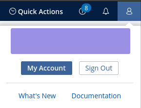
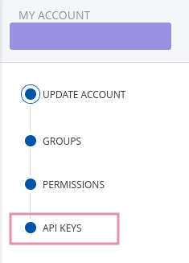
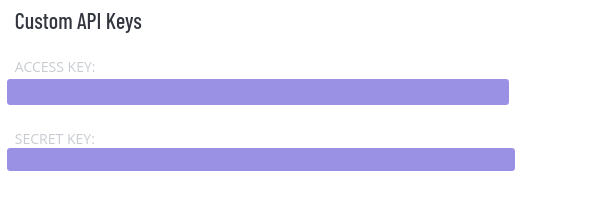

1. you can generate a key by selecting profile in the corner and clicking "My Account" 
 
2. select api keys 
 
3. copy both secret and access keys 
 
4. form the TENABLE_API_KEY variable filling in the gaps 
`export TENABLE_API_KEY='accessKey=accesskey;secretKey=secretkey'` 
5. you should be able to authenticate now! Keep this key safe! 